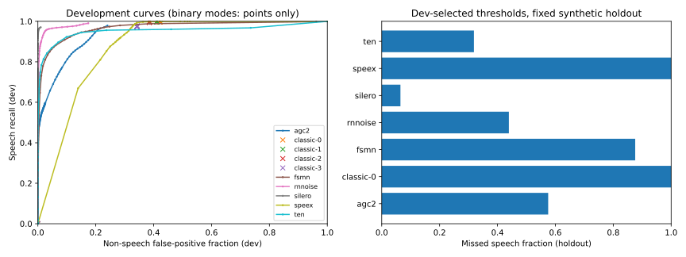
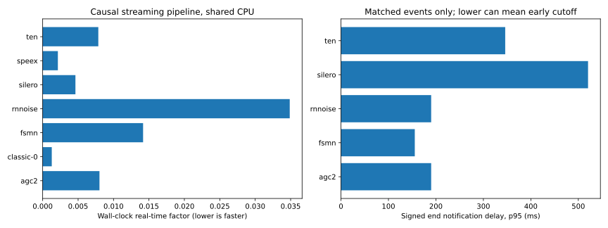

# Synthetic streaming benchmark results

**Synthetic-domain experiment, not real-microphone accuracy or human phonetic ground truth.**

240 streams, 1.33 hours; 96 development and 144 fixed holdout streams. Four synthesis voices are split between dev/test. The same synthesis engine is shared, so this is not cross-engine generalization.

Labels come from known source placement plus clean-signal activity proxies, with uncertainty excluded. Generic speech includes background voices. A foreground-only diagnostic is separately reported and is not a fair expectation for speaker-agnostic VAD. See [dataset methodology](../../docs/DATASET.md).

## Frozen operating point

Thresholds and classic aggressiveness are selected only on development data: minimize missed speech subject to at most 5 unmatched activations per negative-audio hour AND at most 1% non-speech frame false positives. The shared grid is dense in the high-probability tail (0.99 through 0.9999 in 0.0001 steps), includes finer near-one values and a never-positive threshold. Its exact values are in summary.json. A source/metrics audit identified that the initial coarse grid skipped feasible development points; this common dev-only grid corrects that issue without selecting thresholds from holdout. This can select an unusable all-miss detector; no feasible useful operating point is a result, not a reason to retune on holdout. Constraints need not transfer to holdout.

| Backend | Threshold | Holdout miss % | Holdout false-positive % | False events/negative hour | Event recall % | Extra fragments |
|---|---:|---:|---:|---:|---:|---:|
| agc2 | 0.999 | 57.516 | 0.003 | 3.533 | 93.333 | 475 |
| classic-0 | 1.001 | 100.000 | 0.000 | 0.000 | 0.000 | 0 |
| fsmn | 0.998 | 87.587 | 0.003 | 1.771 | 87.500 | 528 |
| rnnoise | 0.999 | 43.930 | 0.000 | 1.766 | 97.083 | 334 |
| silero | 0.800 | 6.463 | 0.004 | 3.533 | 97.500 | 3 |
| speex | 0.990 | 100.000 | 0.000 | 0.000 | 0.000 | 0 |
| ten | 0.900 | 31.856 | 0.002 | 0.000 | 95.000 | 128 |

## Reference points and tradeoffs

The severe calibrated budget above is only one operating point. The following fixed reference points were not optimized on holdout: 0.5 for most probability/binary scores, 0.35 for Speex’s documented entry probability, and 0.8 for FSMN’s approximate raw-posterior equivalent of its speech/noise margin. These are **not complete vendor-default detectors**: the common 200 ms endpoint policy replaces package-specific gates, hysteresis and segmentation. In particular, FSMN’s native energy gate is absent. Classic mode 2 is shown as the normal reference, independent of the calibrated mode choice.

| Backend | Reference threshold | Holdout miss % | False-positive % | False events / negative hour |
|---|---:|---:|---:|---:|
| agc2 | 0.500 | 10.738 | 15.486 | 1411.418 |
| fsmn | 0.800 | 5.491 | 11.686 | 329.497 |
| rnnoise | 0.500 | 0.831 | 3.477 | 482.249 |
| silero | 0.500 | 5.049 | 0.051 | 31.797 |
| speex | 0.350 | 0.164 | 42.655 | 651.831 |
| ten | 0.500 | 6.278 | 2.068 | 777.252 |
| classic-2 | 0.500 | 0.137 | 39.268 | 858.510 |

## False-activation sample uncertainty

| Backend | False events | Known-negative hours | Rate / hour | Descriptive Poisson 95% interval |
|---|---:|---:|---:|---:|
| agc2 | 2 | 0.566 | 3.533 | 0.428 – 12.762 |
| classic-0 | 0 | 0.566 | 0.000 | 0.000 – 6.516 |
| fsmn | 1 | 0.564 | 1.771 | 0.045 – 9.870 |
| rnnoise | 1 | 0.566 | 1.766 | 0.045 – 9.842 |
| silero | 2 | 0.566 | 3.533 | 0.428 – 12.762 |
| speex | 0 | 0.566 | 0.000 | 0.000 – 6.516 |
| ten | 0 | 0.566 | 0.000 | 0.000 – 6.516 |

Intervals assume Poisson event arrivals and are descriptive only: the repeated synthetic voices/texts and structured conditions are not independent natural audio. A zero observed count does not establish a zero real-world rate. Inspect the full development curves; do not rank models solely by this severe threshold or by short endpoint delays that can result from clipped/fragmented speech.

## Timing and notification

| Backend | Wall RTF | CPU RTF | Startup s | Peak process MiB | Onset clipping p95 ms | End notification p50 / p95 ms | Matched latency events |
|---|---:|---:|---:|---:|---:|---:|---:|
| agc2 | 0.008 | 0.008 | 0.001 | 103.043 | 2497.500 | -415.000 / 190.000 | 224 |
| classic-0 | 0.001 | 0.001 | 0.002 | 102.129 | n/a | n/a / n/a | 0 |
| fsmn | 0.014 | 0.014 | 0.023 | 124.730 | 3680.000 | -1305.000 / 155.500 | 210 |
| rnnoise | 0.035 | 0.035 | 0.017 | 114.875 | 1693.000 | 50.000 / 190.000 | 233 |
| silero | 0.005 | 0.005 | 0.048 | 118.152 | 321.200 | 290.000 / 520.500 | 234 |
| speex | 0.002 | 0.002 | 0.001 | 95.000 | n/a | n/a / n/a | 0 |
| ten | 0.008 | 0.008 | 0.002 | 98.770 | 1738.800 | 180.000 / 346.000 | 228 |

## Interpretation and limits

- Unknown native score alignment is left uncompensated and recorded as null. Frame-boundary accuracy for these adapters is not alignment-calibrated; native lookahead is documented separately. AGC2 is a historical extraction; FSMN is raw posterior, not native segmentation.
- Native frame sizes, context, state, and causal FIR resampling are preserved. Input arrives in simulated 10 ms capture blocks. Retrospective score alignment is separate from actual acquisition-time notification.
- A common 200 ms silence endpoint rule is used, with no padding or separate exit threshold. It does not reproduce each vendor’s native endpoint defaults. EOF-forced endings are excluded from latency distributions.
- Event reference intervals merge clean activity gaps up to 200 ms. Matching is globally greedy one-to-one by descending overlap; overlapping extra fragments are counted separately. Long merged detections cannot count as multiple correct events. Delays are conditional on matched events; read them together with recall, premature notifications, source end clipping, fragmentation, and misses in summary.json.
- False activation events are unmatched segments with no reference overlap per known-negative hour; the separate frame false-positive cap prevents a single long activation from gaming event counts. Unmatched events with any known-negative grid support count as false activations; events supported only by uncertainty are separately censored.
- The dataset and split were fixed before execution. Preliminary holdout results were viewed during validation; common metric fixes and the denser shared development-only threshold grid were then audited. This is not a blinded or preregistered study; no thresholds are selected from holdout performance.
- Development has only 32 minutes and holdout 48 minutes, with still less known-negative time. Low false-event rates are quantized and statistically uncertain; this is not evidence of a production 5/hour guarantee.
- Single measured corpus pass after warmup; shared unpinned cloud CPU, no frequency control. RTF includes buffering, resampling, dispatch, and inference; excludes WAV reads and reset. Startup is adapter construction, not a full process import.
- Memory is isolated-backend peak process RSS including Python, dependencies, and stored traces. It is not model-only RAM. File/package size and RSS must not be conflated.
- Notification delays use simulated audio-acquisition time and exclude compute scheduling. They are algorithmic pipeline delays, not measured device-to-application wall latency.
- Synthetic fan, typing, music-like interference and TTS speech do not represent real rooms or microphones. No human labeling was performed. Do not generalize the ranking to natural speech without external validation.
- Historical results and REPORT.md remain unchanged. Machine-readable full metrics, adapter pins, provenance, blocked status, and calibration curves are adjacent.

